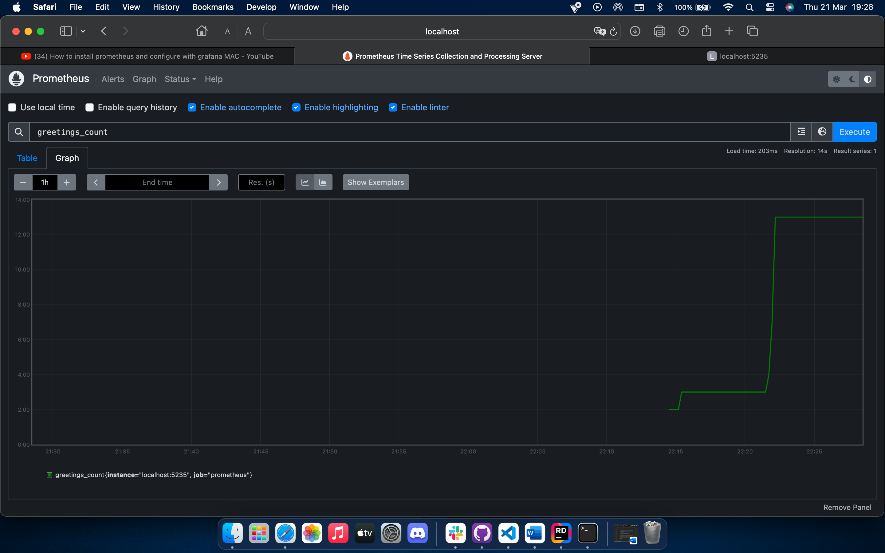
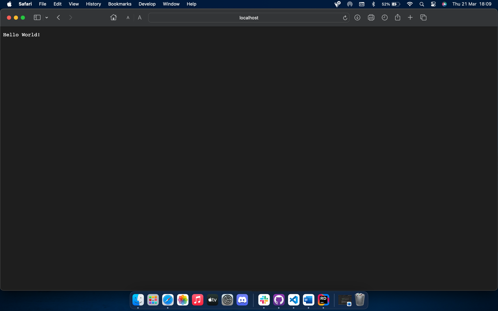
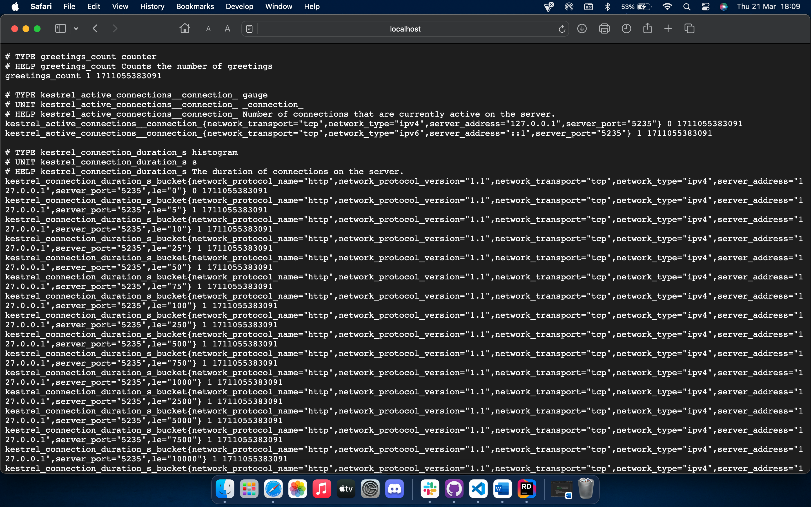

# ponderada-s7-2

## Tecnologias utilizadas

Para realizar essa ponderada, foi utilizado o Prometheus e o OpenTelemetry. A primeira, é uma plataforma de monitoramento de código aberto projetada para coletar e armazenar métricas de sistemas e serviços distribuídos, permitindo consultas flexíveis e geração de alertas com base em regras definidas pelo usuário. Já a segunda, é um projeto de código aberto que padroniza a instrumentação de aplicativos para coletar telemetria, incluindo rastreamento de solicitações, métricas e logs.

## Conceitos aprendidos

Ao realizar essa ponderada, eu pude entender como o Prometheus funciona, o que vai me ajudar muito a implementá-lo no projeto, além de entender a estrutura necessária para fazer uma métrica. Por último, também pude complementar o meu aprendizado de logs, uma vez que ele me mostrava o log da métrica medida.

## Resultados

Para fazer a aplicação funcionar, foi necessário:

Adicionar o SDK do OpenTelemetry:
```
using OpenTelemetry.Metrics;
using OpenTelemetry.Resources;
using OpenTelemetry.Trace;
```

Criar a métrica:

Essa métrica irá adicionar 1 toda vez que um usuário entrar em uma página específica.
```
var greeterMeter = new Meter("OtPrGrYa.Example", "1.0.0");
var countGreetings = greeterMeter.CreateCounter<int>("greetings.count", description: "Counts the number of greetings");
```

Configuração do Prometheus para coletar as métricas:


</br>

Aplicação funcionando:


</br>

Logs da métrica:


</br>
